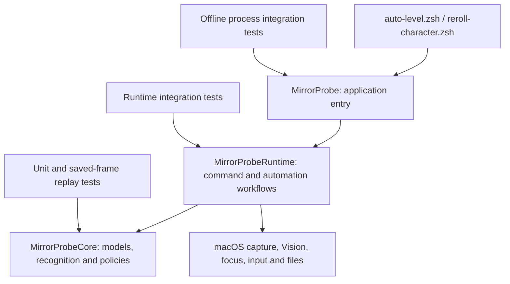

# Architecture and optimization plan

Reviewed on 2026-09-15. The existing development state is preserved in commit
`1bc7d64`; the first architecture pass builds on that baseline.

## Dependency boundaries

| Component | Responsibility | Boundary |
| --- | --- | --- |
| `Sources/MirrorProbe` | `@main`, AppKit/run-loop lifetime, exit status, Quit delegate | No recognition or automation policy |
| `MirrorProbeRuntime/Commands` | Argument validation, command dispatch helpers, run setup | Converts user input into runtime configuration |
| `MirrorProbeRuntime/Analysis` | PNG loading, RGBA conversion/recognition pipeline, analysis reports | Offline path exercised by both runtime and process tests |
| `MirrorProbeRuntime/AutoLevel` | Observations, battle tracking, preflight, input and repeating loop | Composes Core policies with platform operations |
| `MirrorProbeRuntime/CharacterReroll` | Stable observations, threshold checks, reroll/acknowledgement flow | Keeps reroll workflow separate from battle workflow |
| `MirrorProbeRuntime/Platform` | Window capture, focus borrowing/restoration, event posting, image encoding | Owns macOS framework interaction |
| `MirrorProbeRuntime/Reporting` | Report models, screenshot retention and JSON persistence | Owns durable outputs and terminal summaries |
| `Sources/MirrorProbeCore` | Shared models, pixel/OCR evidence, state machines, retry and safety policies | No AppKit, ScreenCaptureKit or Vision; the run lock is an explicit Darwin/filesystem exception |

`MirrorProbeRuntime` is an internal package target, not an additional distributed
library product. Its public entry points are command execution and an application
Quit request. Cross-file workflow helpers are internal and available to the
runtime test target through `@testable import`.

## First pass completed

- Extracted the 6,023-line executable implementation into an importable runtime
  target and files grouped by responsibility. The executable entry is now about
  40 lines. This moves existing production code into reach of tests; it preserves
  command/report contracts and the existing safety sequence.
- Moved normalized geometry, OCR observations, and shared game/action models out
  of `GameStateClassifier.swift`. Pixel-based recognition no longer has its model
  declarations hidden in the legacy OCR classifier file.
- Shared overflow-safe RGBA layout validation across frame analysis and full/
  regional difference calculations. Invalid dimensions produce errors instead of
  trapping on integer multiplication.
- Validated window identities and finite, non-empty geometry before allowing
  input; retained support for negative screen origins on multi-monitor systems.
- Added runtime, offline CLI, reroll-launcher and real filesystem/process-lock
  tests, plus one offline verification command and a macOS CI workflow.

## Runtime flow and invariants

The auto-level runner observes the chosen window, classifies pixels, updates
temporal progress/recovery state, and passes a snapshot to `AutoLevelController`.
A requested action then requires a newer preflight, trusted target geometry,
window/focus continuity and an unexpired input authorization. Only a posted
event counts as input. A later observation must acknowledge the action before
the controller can move on.

The reroll runner obtains independent full-frame/focused OCR and rendered-digit
evidence, waits for stability, then performs a final pixel guard before Random.
A keeper/conflicting boundary is sticky: later low OCR cannot authorize another
reroll. Tests for these invariants must survive future refactors.

Saved-image tests prove the behavior of recorded pixels and explicitly modeled
continuations. They do not prove a real macOS click was received or that a missing
interval in a historical run remained stable.

## Next optimization passes

These are remaining findings, not changes completed by this pass. Each item has
an observable completion criterion so subsequent work can be committed separately.

### 1. Inject dependencies into the production automation loops

`AutoLevelRunner.swift` still contains a roughly 1,400-line loop, and the reroll
runner still owns substantial mutable state. Moving the code into a target does
not by itself decouple capture, time, input and persistence.

Introduce narrow interfaces for a monotonic clock, observed window frames, input
posting and report storage. Start with battle-session lifecycle and preflight
transactions; keep the live runner calling the same extracted operations that
tests exercise. Avoid a second, test-only implementation of the loop.

Completion tests should drive the production workflow through:

- successful result/repeat selection, posted action, acknowledgement and next battle;
- stale observations that acknowledge past input but cannot authorize new input;
- focus contention followed by a completely new preflight;
- STOP/expiry during capture or retries, including focus cleanup and terminal report;
- capture/persistence failure and loss of window continuity;
- startup-frozen recovery versus a later frozen battle.

### 2. Bound long-running report persistence

`Reporting/AutoLevelReporting.swift` appends every event to `report.events` and
rewrites the whole JSON report. With n events, memory is O(n) and cumulative
serialization/write volume is O(n²). This matters because run limits are optional.

Use an append-only event journal plus a bounded, atomically replaced summary.
Version the report contract explicitly and preserve launcher fields (`status`,
`completedCycles`, `actionsPosted`, `finalReason`). Test monotonic event sequence,
large histories, partial writes, summary/journal disagreement and terminal errors.
Benchmark bytes written as well as execution time.

### 3. Bound battle-scoped state

`autoEnabledBattleIDs` and `resumableStallProgressByBattleID` retain historical
battle identifiers. Replace these collections with explicit current-episode
state after documenting how modals suspend and resume the same episode. Test many
completed episodes and verify stored state remains bounded without losing recovery
proof during a temporary overlay.

### 4. Reduce fixture and documentation maintenance costs

Keep original incident evidence and hashes, but centralize repeated test image
decoding and fixture lookup. Inventory duplicate PNGs before consolidating them:
resource paths and provenance manifests are part of regression reproducibility.
Move release narratives out of README into a changelog in a separate documentation
pass; keep current usage, architecture and test instructions easy to find.

## Working rhythm

1. Capture an observed failure or define measurable expected behavior.
2. Add a failing test at the lowest meaningful level, plus a boundary integration
   test when behavior crosses modules/processes/files.
3. Refactor the production path and run `zsh Scripts/test.sh`.
4. Commit one coherent improvement with its validation. Use `--coverage` to locate
   unexercised branches, not as a substitute for meaningful assertions.

See [testing.md](testing.md) for verification commands and their limits.
